# SEforAll - Website
 
## Project description

The project's goal is to create accurate building footprint data sets using machine learning.
This will improve energy and infrastructure planning by identifying human activity, urbanization trends, and energy demand patterns, enabling more precise energy access initiatives.

The objective of this project also included creating a static website where this issue can be addressed for a specific area.
- [Website link](https://websitebucket.s3.eu-de.cloud-object-storage.appdomain.cloud/index.html)

## Goals

- Create a simple website with some interactive map
- Add an option to find a county or district from a list and automatically visualize all buildings belonging to the area on the map. Additionally, provide a short summary in a dedicated panel
- Ability to create custom specific polygon
- Ability to edit polygon and submit it
- Process the given polygon, send created polygon to database and find all buildings belonging to the chosen polygon
- Calculate and summarize all available data of found buildings, split them to residential and non-residential
- Visualize all buildings on the interactive map, providing details about selected buildings and provide a short summary in a dedicated panel
- Ability to submit custom polygons by uploading shapefiles and automatically visualize all buildings belonging to the custom polygon. Additionally, provide a short summary in a dedicated panel
-	Ability to compare details about two or more buildings
- Make the website simple and easy to use
- Provide a short summary about the data processing, website capabilities and active engagements
- Allow end users to provide feedback on the tool
- Allow end users to download building information for pre-defined areas of interest (such as countries, states or counties)
- Collect anonymous, aggregated usage information
- Collect voluntary profile information about end users

## Components

The entire structure of the website consists of two parts, the backend and the frontend described below.

### Backend

See the associated repository for more details

### Frontend

The frontend part of the website uses declared endpoints from the backend from where it receives well-prepared data. Alternatively, it loads one of the pre-computed data sets to speed up the building visualization for larger, pre-defined areas.

In addition, the frontend part contains the implementation and setting of the map and is also responsible for the visualization of building data on the map.
Frontend part is also responsible for whole user interface functionality and implemented features. The entire frontend acts like a separate component, and it is deployed to Cloud Object Storage on the IBM Cloud as shown in [Figure 1](#website-components).

More information about communication between frontend and other parts of the website is provided in [Section Scenarios](#scenarios), providing an in-depth overview of the different workflows handled by the website.

## Code Structure

- `/backend/server.js` Core of backend part including endpoints which communicate with database and prepare data for frontend
- `/backend/Dockerfile` Configuration for building docker image
- `/frontend/index.html`, `/frontend/about.html`, `/frontend/feedback.html`, `/frontend/methodology.html`, `/frontend/share.html` Static html websites
- `/frontend/map.html` Static html website, handling the main workload of the website in a form of an interactive map
- `/frontend/reosurces/js/script.js` Contain functionality of static html website and call backend endpoints for process data which are summarized and visualized in user interface
- `/frontend/reosurces/assets` Directory of assets
- `/frontend/reosurces/css` Directory of CSS files
- `/frontend/reosurces/images` Directory of used images
- `/backend` Include all necessary files for backend part
- `/frontend`Include all necessary files for frontend part

## Setup

1. Install Node.js
2. `cd ../web-site/backend`
3. `npm install`
4. `npm run compile`
5. `npm start`
6. Open <http://localhost:8080/> and verify
7. Commit changes to repository

## Dependencies

| Project            | Home Page                                          |
|--------------------|----------------------------------------------------|
| Express            | <https://expressjs.com/>                           |
| Leaflet            | <https://leafletjs.com/>                           |
| Turf               | <https://turfjs.org/>                              |
| Bootstrap          | <https://getbootstrap.com/>                        |
| DataTable          | <https://datatables.net/>                          |
| IBM Cloudant       | <https://www.ibm.com/products/cloudant>            |
| ibm-cos-sdk        | <https://pypi.org/project/ibm-cloud-sdk-core/>     |
| yaml               | <https://www.npmjs.com/package/js-yaml>            |
| swagger-jsdoc      | <https://www.npmjs.com/package/swagger-jsdoc>      |
| swagger-ui-express | <https://www.npmjs.com/package/swagger-ui-express> |
| cors               | <https://www.npmjs.com/package/cors>               |
| body-parser        | <https://www.npmjs.com/package/body-parser>        |
| sweetalert2        | <https://sweetalert2.github.io/>                   |
| jszip              | <https://stuk.github.io/jszip/>                    |

## Code Governance

Following best governance practices the frontend of the application is developed, deployed and tested on three different cloud environments each dedicated to specific tasks from the code life-cycle, supported by deployment automation.

The following environments are defined with associated responsibilities:
 - Local Computer - while not one of the cloud hosted environments it serves to concurrently develop new features to the frontend of the application.
 - DEV - serves for merging different features from local computers into a shared codebase, integrate the new code with the cloud resources and verify results by developers.
 - TEST - hosts select features pushed from DEV before Production deployment, provides access to testers and select stakeholders to verify features before prod deployment.
 - PROD - hosts a stable and tested version of the website frontend for end user interactions.

It is important to highlight, that this process governs only the frontend side of the application, the backend, underlying building information and pre-generated output files for downloading purposes are all shared across all environments. One notable exception are the databases, which hold user specific or usage information, e.g., counters for the API calls. In these cases all environments share a single Cloudant database, but it hosts three versions of documents, one dedicated to each environment.

<figure>
  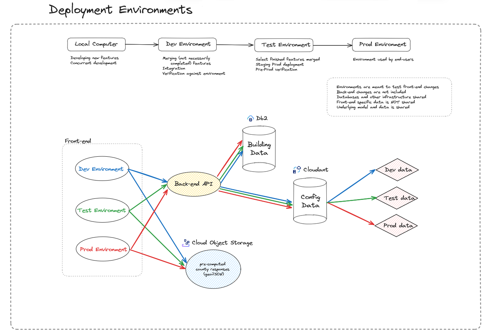
  <figcaption>Figure 2: This figure shows how the different environments interact with each other</figcaption>
</figure>

The deployment pipelines are handled by Travis CI, which is triggered automatically in case of new commits pushed into select branches in github. The `dev`, `test` and `main` branches in git are associated with the DEV, TEST and PROD environments respectively.

<figure>
  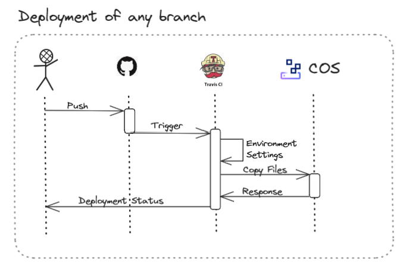
  <figcaption>Figure 3: This figure shows how code deployment is automated using github and Travis CI</figcaption>
</figure>

Building the docker image and dpeloying it to code engine is a semi-automated process, during which Docker is utilized, installed on a dedicated virtual machine to build a new docker image for the application backend based on the latest codebase, which is pushed into the Code Registry. This image can be deployed to the Code Engine application manually using the IBM Cloud UI.

<figure>
  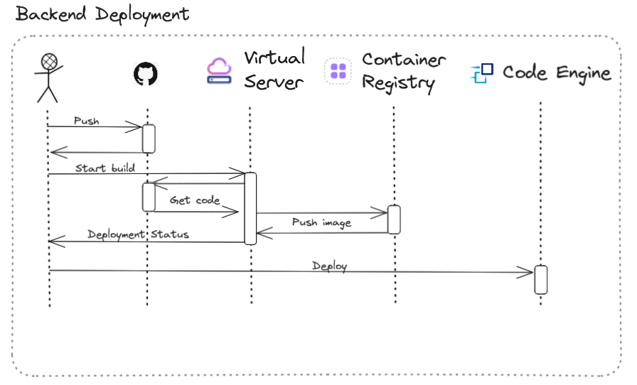
  <figcaption>Figure 3a: This figure shows how code for application backend is built into a docker image, pushed into the registry and deployed to the Code Engine</figcaption>
</figure>

## Scenarios

If it was possible to install all the necessary things to start the website, then we will see the official landing page of the application as soon in [Figure 4](#start-page). 

<figure>
  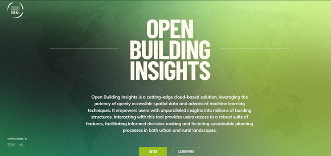
  <figcaption>Figure 4: Showcase of the Landing Page of the application</figcaption>
</figure>

From this site new users are approached to fill in a voluntary survey, already established users can either use the Enter button to open the Map page containing the main functionality of the application or use the Learn More button to obtain more information about the application, underlying data, use cases and cooperation.

---

New users are presented with a short survey, which is voluntary and can be skipped at any point.

<figure>
  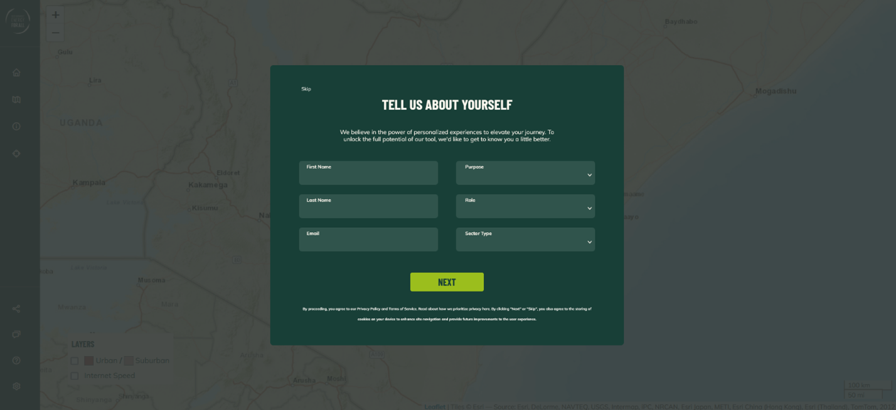
  <figcaption>Figure 5: First page of the new user survey</figcaption>
</figure>

The survey extends two pages, where the first page contains information about the end user itself, while the second page focuses on the ways the end user would like to utilize the application. The survey can be submitted once both pages are filled.

The information is sent to the backend of the solution, which cleans and stores the information as a dedicated JSON document in Cloudant.

<figure>
  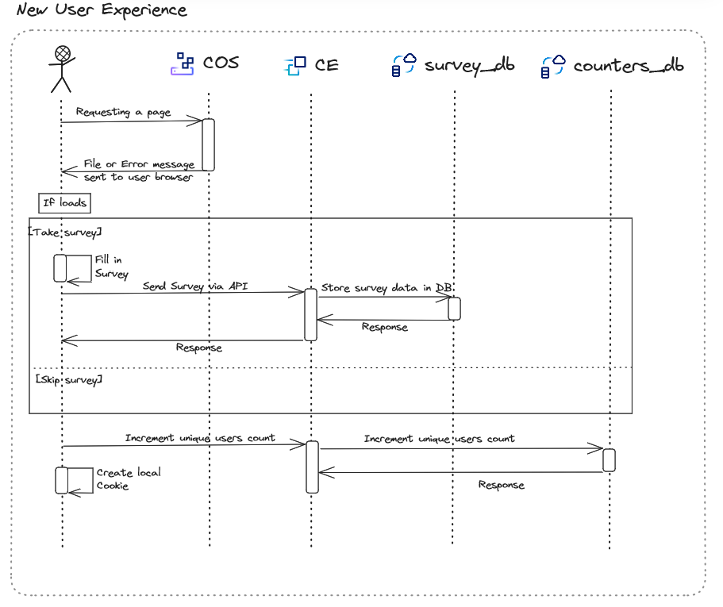
  <figcaption>Figure 6: The workflow related to the new user survey</figcaption>
</figure>

Once the survey is submitted or skipped a special cookie is assigned to the end user, stored in his local computer denoting that the user is already a recurring user, hence skipping the survey on next load.

The survey is responsible to count the total number of new unique users as well, utilizing the aforementioned cookie to distinguish users and storing information in a dedicated Cloudant database.

---

Recurring users can navigate between the frontend capabilities using the menu panel located on the left-hand side of the website. The menu panel by default shows icons only, but it can be extended by clicking on the three bar button at the top. In the extended version menu options are depicted not only as icons, but also by a descriptive labels.

<figure align="center">
  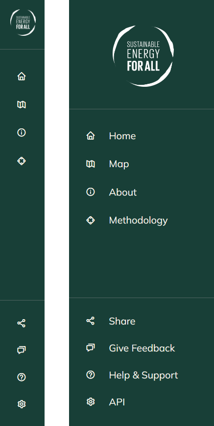
  <figcaption>Figure 6: The basic view of menu is shown on the left, while on the right side of the figure the extended menu is shown, containing captions for menu options as well as the SEforALL logo</figcaption>
</figure>

---

The application frontend provides wide variety of information about data, data sources, application capabilities and engagements. This information is provided in a form of static websites, which can be accessed via the left menu panel.

<figure>
  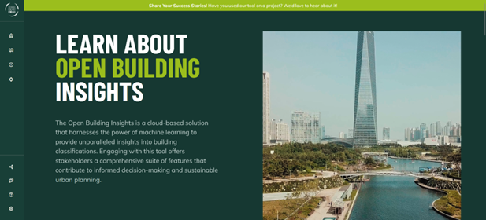
  <figcaption>Figure 7: The About page shown on the figure is a prime example of a static page containing useful information</figcaption>
</figure>

All frontend web pages are stored in IBM Cloud Object Storage, accessed, downloaded and rendered by web browsers on the client side.

<figure>
  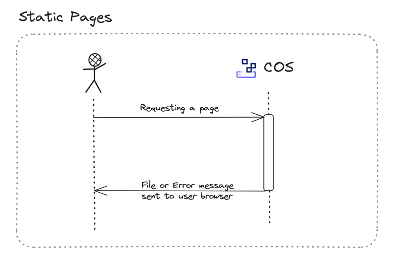
  <figcaption>Figure 8: The usual workflow to obtain content from a static web page</figcaption>
</figure>

---

The main part of the application visualize building data on the underlying map and providing useful aggregates for select areas. End users can select one of three options to define their area of interest as shown in [Figure 9](#map_options).

<figure>
  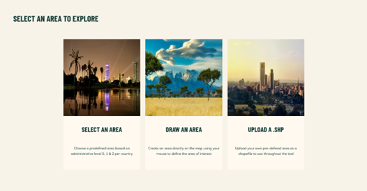
  <figcaption>Figure 9: The map page provides three options to define areas of interests for end users</figcaption>
</figure>

The first option, `Select an Area` allows end users to choose an area from a list of pre-defined administrative boundaries, such as counties or districts, and visualize all buildings from a given administrative boundary.

<figure>
  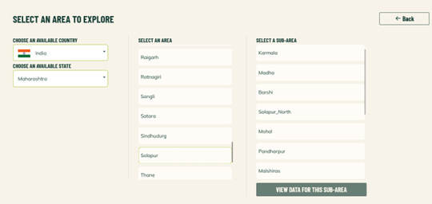
  <figcaption>Figure 10: Once Select an Area option is chosen end users are presented with a wide choice of different types of administrative boundaries within a given country to select the one most suitable for them</figcaption>
</figure>

Once an area of interest is selected the application gathers information about all buildings within the given administrative boundary, downloads and visualize them. Aggregated information can be found in the left panel on the screen, while detailed building information is provided in a small window in the bottom-right corner once hovering over a building.

Building data can be saved in a geoJSON format by clicking on the highlighted button on the left panel.

<figure>
  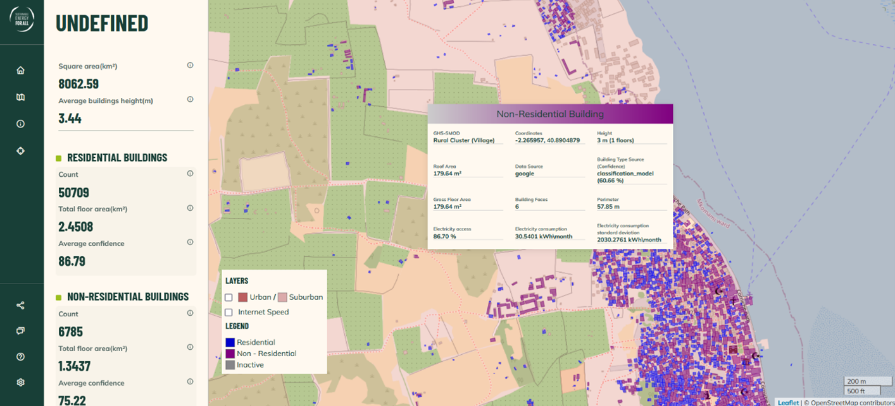
  <figcaption>Figure 11: Visualization of buildings within an administrative boundary</figcaption>
</figure>

Given, that administrative boundaries are stable the application does not need to query the database for buildings belonging to a select area, increasing the responsiveness of the application by downloading a pre-prepared data set compared to waiting for a database system to handle the search. This workflow is depicted in [Figure 12](#map_area_workflow).

<figure>
  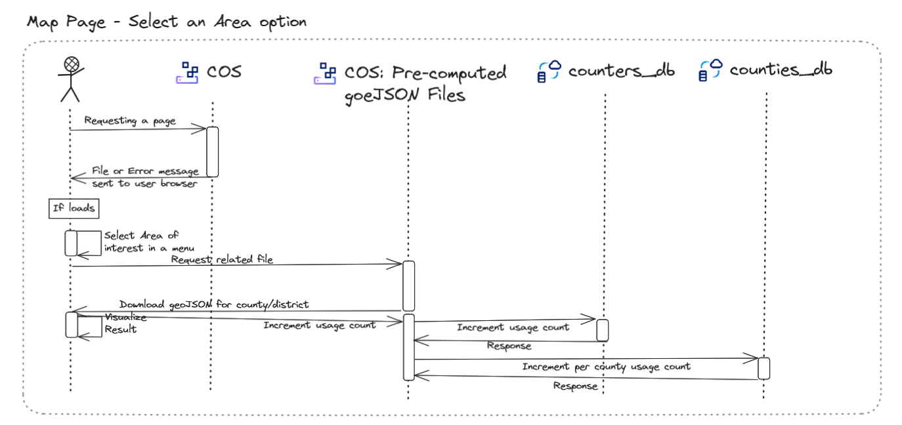
  <figcaption>Figure 12: A schema depicting the workflow of the Select and Area option</figcaption>
</figure>

The second and third option in the main menu, namely the `Draw and Area` and `Upload a .shp` are described now jointly, as they share most of their workflow. These two options provide two distinct ways to define custom areas of interest using polygons, regardless of existing administrative boundaries.

Once the `Draw and Area` option is selected the end user is available to select a polygon on the map by clicking with the mouse. Once the polygon is connected it can be submitted to the backend of the application for processing using the button in the top-right corner of the page. Alternatively, it can be further adjusted to support the needs of the end  user.

<figure>
  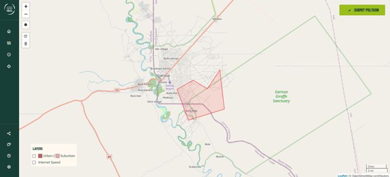
  <figcaption>Figure 13: End users can draw polygons to define areas of interest by clicking on the map</figcaption>
</figure>

Using the `Upload a .shp` option the tool can use an already existing polygon stored as a shapefile to define the area of interest. Using this option users need to upload the `.shp`, `.dbf` and `.shx` files related to the polygon. The tool creates the polygon and visualizes it on the map based on the shapefile and from this point forward the workflow joins into the `Draw and Area` option workflow, as users use the Submit button on the top-right corner to submit the polygon visualized on the map to the backend for processing.

Once the application backend obtains the polygon it creates a query against the database containing all building related data and obtains the list of all buildings belonging to the given polygon. Aggregates are computed and the data is provided for the website in a geoJSON format. This data is visualized in the tool as depicted in [Figure 14](#map_polygon_buildings).

<figure>
  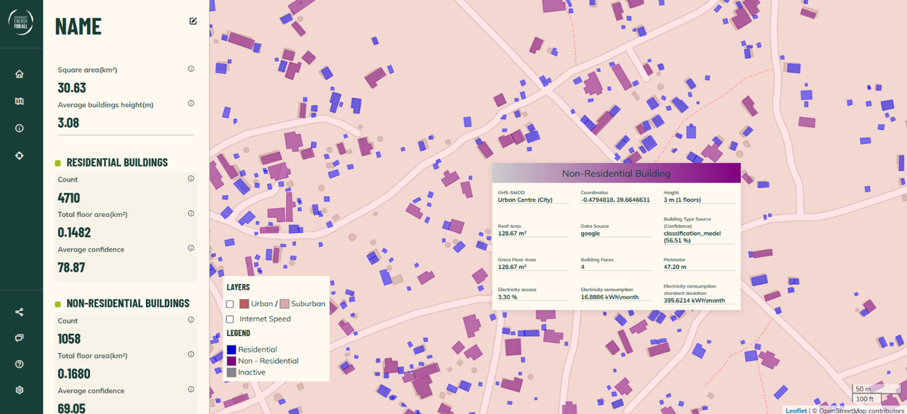
  <figcaption>Figure 14: End users obtain data for all buildings belonging to the polygon they defined</figcaption>
</figure>

End users can assign a custom name to the area of interest and the related data set can be stored in a geoJSON format if needed.

Due to computational constraints end users are prohibited to select extensively large polygons. End user's computers need to be able to store building related data and visualize them efficiently, which is both memory and CPU intensive task, putting this safeguard in place to avoid end users accidentally breaking their browsers.

<figure>
  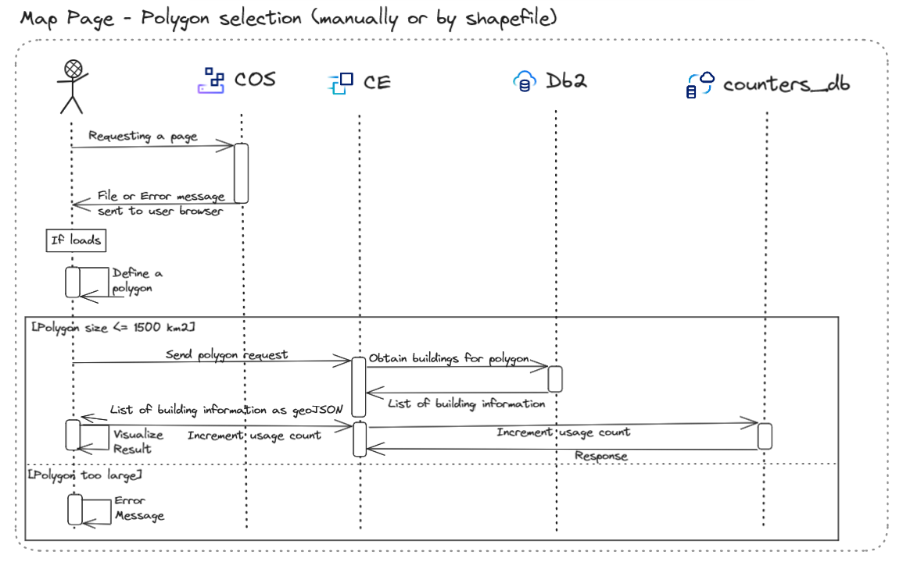
  <figcaption>Figure 15: A schema depicting the workflow, when a custom polygon is defined in the application</figcaption>
</figure>

Building details are provided in a popup window, which appears when hovering over a building on the map. To compare two or more buildings these popup windows can be pinned to the map by clicking on the building, which opens the popup window until it is closed using the small X button on the top-right corner. These pinned popup windows can be arranged using the mouse and their association to a building is highlighted by a color-coded pin appearing in the top-left corner of the popup window, as well as on the building on the map itself.

<figure>
  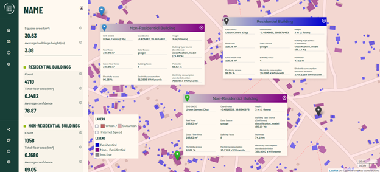
  <figcaption>Figure 16: Comparing buildings by clicking on them to pin the popup window</figcaption>
</figure>

Information about certain buildings can be considered sensitive in certain cases, such as in case of military structures. Such building information is erased from the data set and those buildings are rendered gray on the map as inactive buildings, without an option to open a detailed popup window for them.

The main idea of the application is to visualize building related information in a fine granularity, but sometimes it is useful to view building level information in a wider context - cross referencing it with information usually provided for areas, such as degree of urbanization. The website of the application provides a technical solution, how to overlay area related information to the map providing a quick visual guide to assess building information in a context of choice. The tool currently offers in the bottom left corner the following overlays:
 - Degree of urbanization
 - Internet speed estimates

<figure>
  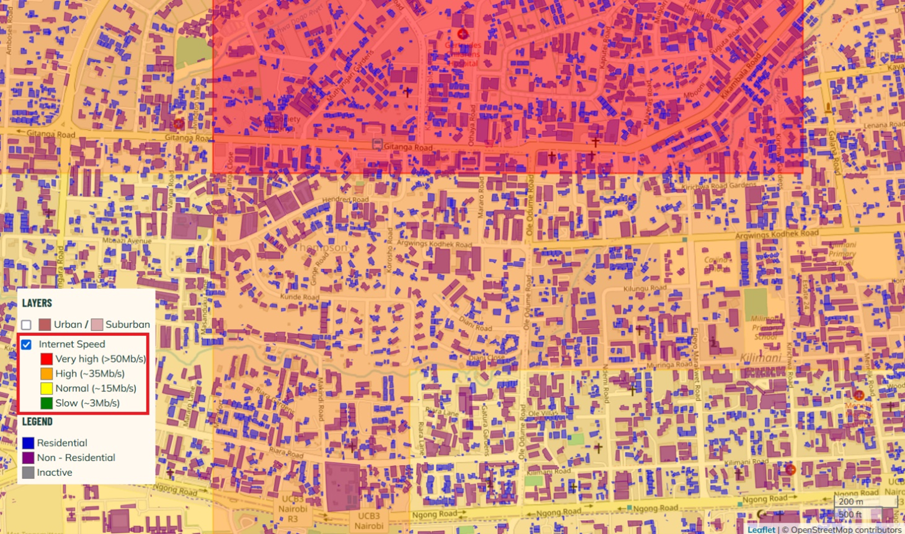
  <figcaption>Figure 17: The estimated internet speed overlay visualized over Nairobi</figcaption>
</figure>

The website tracks anonymous usage statistics to drive further improvements. This can be seen in [Figure 12](#map_area_workflow) as well as in [Figure 15](#map_polygon_workflow).

---

The goal of the website is to publish data in a desired format enabling end users to draw conclusions and informed decisions. This can be done by easy-to-understand visualization techniques as seen above, but also by plugging the building data set into a deep analysis possibly together with other data sets to Python or any other programming language.

In this case the visualization of data only slows down the ingestion process for the end user, therefore the `Share page` of the website provides a shortlist of available data sets in a geoParquet format to address this type of usage.

<figure>
  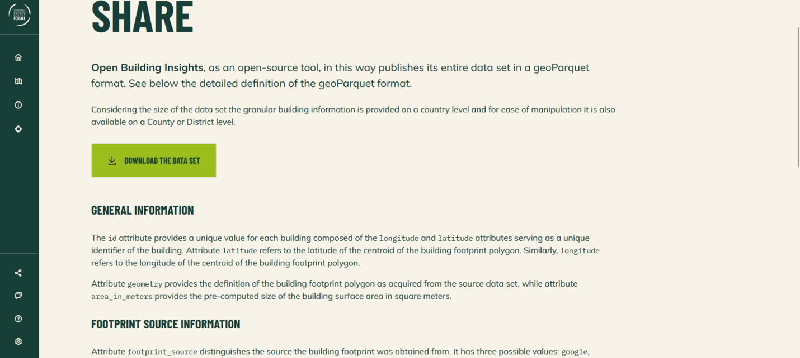
  <figcaption>Figure 18: The share page provides technical description of the data set. Once the area of interest is selected from a pre-populated list the download starts automatically</figcaption>
</figure>

As the end user is selecting its area of interest from a pre-populated list the application is not querying the database to enhance the user experience. The geoParquet file related to any of the options is pre-generated and stored in the Cloud Object Storage ready to be downloaded.

<figure>
  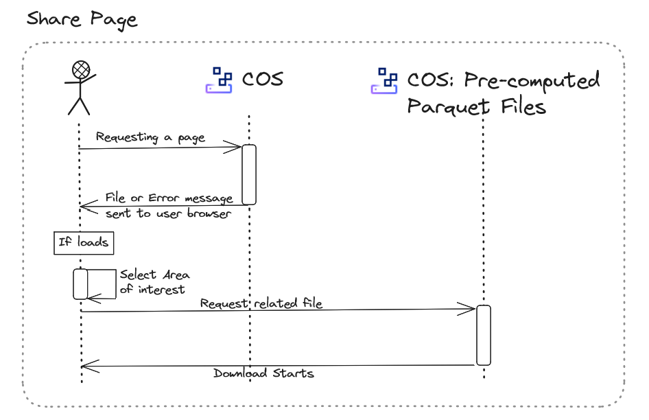
  <figcaption>Figure 19: The schema depicting the actions supporting the functionality of the share page</figcaption>
</figure>

---

We are interested in the feedback from our end users. For this reason a feedback page is created, storing a mainly textual feedback in a database for later reflection.

<figure>
  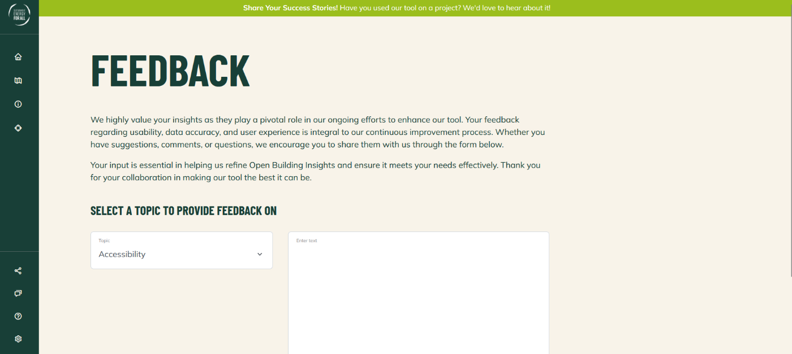
  <figcaption>Figure 20: The feedback page</figcaption>
</figure>

<figure>
  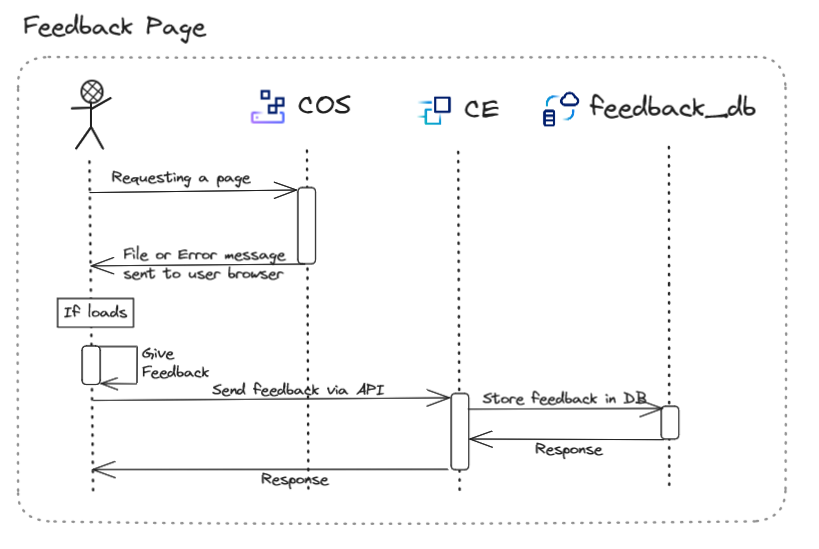
  <figcaption>Figure 21: How the feedback page works</figcaption>
</figure>

---

## Counting Unique Users

To assess the impact of the application and data it provides the approximate number of unique users is counted. The exact number of unique users can not be confidently counted due to the open nature of the application, which does not require any type of registration, while each survey on the page being voluntary.

During the first loading of the website by a new user the counter of unique users is increased. The following options were considered to distinguish new users form recurring ones:

Use of IP address, each IP would be considered a user, so a new IP loading the website would be considered a new user.
 -	Positives:
     - This approach relies on an attribute of the computer, which is hard to temper with or change by end users
     - Each browser on the same computer would be considered the same user
 -	Negatives:
     - VPN connections or multiple work places (such as Home office with Office work) would increase the counts of unique users
     - Dynamic IP addresses may impact the counts as well
     - All previously seen IP addresses need to be stored on server side

Use of a custom generated cookie, which is stored on the computer of the end user, representing a recurring user, missing the cookie – in return – represents a new user.
 -	Positives:
     - No server side storage or computation is needed, The page loaded to the end users computer can decide on its own about the status of the user
     - Work locations has no impact on the unique user counts
 -	Negatives:
     - Each browser used by a user counts as a distinct user, increasing the unique user counter
     - The cookie can be easily removed by the end user, private browser windows removing the cookie once the session is closed automatically – allowing end users to forcibly increase the counters if they wish so

**Decision**: Custom cookies are used to distinguish unique users and using them an estimated counts of unique users is obtained. The reason of this choice is the lower load on the server side of the application, while acknowledging the negatives of the approach. On the other hand there is no incentive for end users to purposefully increase the unique user counter, which mitigates the negatives of the approach.

## Onboarding New Countries

This section provides a step-by-step guide to onboard a new country (or state) into the OBI website. This step is based on two pre-requisites:
-	The data is already prepared for the given country (or state) in its dedicated table in the central DB2 database
-	The lower level administrative boundaries are investigated and a suitable division of the country is selected to populate areas and sub-areas, e.g.,
    - Kenya (Country) -> Counties (Areas)
    - India (Country) -> Maharashtra (State) -> Districts (Areas) -> Sub-districts (Sub-areas)

To set up a new country or state the following steps need to be taken, analogously to the Kenya and Maharashtra setups.

On the backend side server.js is adjusted only:

1.	To the countOfBuildings endpoint add the table name for the new country
2.	Adjust processArea endpoint by adding the new country areas, which is important for swagger API

On the frontend side several files are impacted.

Starting with resources/assets

1.	Update geoparquets_map.json with areas of the new country
2.	Add file with data of internet speed for the new country, which is used as an overlay in the tool
3.	Add file with data about degree of urbanization for the new country, which is used as an overlay in the tool

Following with resources/district_boundaries

1.	Add in Countries_boundaries.json boundaries of the new country
2.	Add a new file with boundaries of every district for the new country

Last, resources/js/scripts.js

1.	Add the new country into function openModalSelect, in dropdown-menu, with its respective flag (which is added as a resource to images)
2.	Add the new country in function areaInCounty, add filepath for file with boundaries of areas of the new country, for identifying in which area polygon was created
3.	Add the new country into function addOverlay, and add here filepath for file with urban split for this new country
4.	Add the new country in function addInternetOverlay, same as point 3 for Internet speed
5.	Add the new country in function findCountryByPolygon, and change image path for that country
6.	After initialize leaflet there is the setMapView variable with function, add there the new county and set right coordinates for displaying map in that country
7.	Update this file which is stored in Cloud https://counties-geojsons.s3.eu-de.cloud-object-storage.appdomain.cloud/geojson_subdistricts_map.json, because it is used to fetch all aeras for the given country
8.	In case a non-default map is required for the new country, in chosen cookies set a suitable Leaflet map for the new country 

## Future Improvements and Extensions

Our current website could be improved / extended in these areas:
- Scale model to other geography, by leveraging current solution as much as possible.

## Conclusion

In this solution, the user is able to create different polygon areas, submit these areas and after a certain time, according to the size of the selected area, the user has an overview of the buildings located in the area. Based on these building data, useful data for the selected area are aggregated in the left panel. This solution can be further improved and also used for other countries.

## License

Copyright 2022-2023 SE4ALL

UNDER CONSTRUCTION: Add licence
